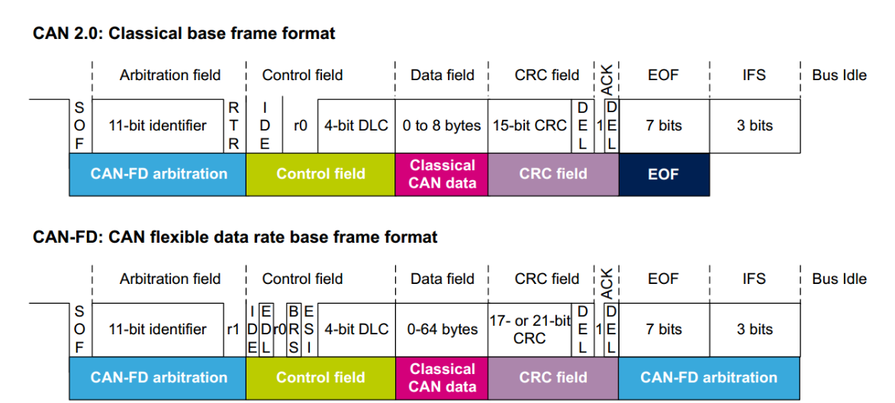

# CAN 总线简介

## 目录

1. [基本概念](#基本概念)

   - 1.1 汽车电子心系统使用CAN的必要性
   - 1.2 车载网络概念

2. [CAN总线基础](#CAN总线基础)
   - 2.1 特点

3. [CAN帧](#CAN帧)
   - 3.1 CAN 2.0A (Standard Frame)

# 基本概念

## 1.1 汽车电子心系统使用CAN的必要性
1. **CAN**（Controller Area Network）: 现代汽车电子中一套非常核心的通信协议, 汽车电子系统中对总线的可靠性, 效率和安全性有很高的要求

## 1.2 车载网络概念

1. **What？**
- 车载网络技术是通过总线的方式, 把车身上的各种控制单元给联通起来, 用于数据共享, 传输和之间的相互通信, 这样的一个集成化的一个系统

2. **How？**
- 通过什么方式来实现呢, 根据传输速率和带宽的不同, 目前大体上有这些通信的协议: LIN, CAN, CANFD, Ethernet, MOST, 以及现在流行的 someip 这些分布式的车机通信系统, 这些总线有不同的通信速率, 可以划分为第, 中, 高三种, 但是像 CAN这种通信速率的高速也没有很高的, 一般是几十K到几百K之间, **主要是用在于地盘CAN和车身CAN, 成本较为低廉**

3. **Why？**
- 主要用于各控制单元, 域控制器之间的数据通信, 共享, 以及减少车身的线束复杂度, 同时**简化网络拓扑**, 提高车辆性能

# CAN总线基础

## 2.1 特点
1. 去中心化, 分布式的原则, 有以下的特点: 
    - 成本低廉
    - 去中心化, 节点之间没有中心控制器
    - 采用双绞线的连接方式, 通过差分方式进行数据传输, 抗干扰能力强
    - 有仲裁和多种传输错误检测机制, 传输安全性和可靠性较强, 容错率高

## 2.2 速率
1. 低速 CAN 是0-125 bit/s, 中速 CAN 是在其之间, 高速 CAN 是0-1M bit/s
2. 比较常用的就是 250K bit/s 和 500K bit/s, 这已经数传输速率比较高了

## 2.3 CAN车身网络拓扑（下面的比较老了）
0. 网关（类似于路由器的作用）
1. 诊断CAN 主要用于车身诊断, 各功能模块的诊断
2. 驱动CAN 主要是用于 发动机, 变速箱, 安全气囊, ABS , AFS等
3. 信息CAN 收音机, 多媒体接口, 音视频等, 用于信息的传输
4. 舒适CAN 例如一些空调, 雨刮, 多功能方向盘, 车身门等
5. Ethernet TBox 

## 2.4 简单的拓扑介绍
1. 用手机控制远程控制车身温度为22°
首先是车身上的 Tbox 是能联网的, 我们手机发送指令后, Tbox接收到指令后进行解析并通过 Ethernet 把数据传输给网关, 网关负责把 Ethernet信息转换为 CAN信息, 并下发到 舒适CAN的链路, 进行指令下发, 这就是一个一个简单的网络拓扑连接

# CAN帧
[同一时刻,总线上只有一帧报文进行发送,不允许同一时刻有多帧报文的发送,否者会造成报文的冲突](https://www.zhihu.com/column/c_1698108165928062976)

## 3.1 国际标准 ISO11898-1/2/3/4
1. 最高传输速率1M bit/s 的情况下, 允许有 40M 的传输距离
2. 标准规定最大的节点是 32（现在最大支持是 一百多, 看芯片）
3. 有终端电阻的存在, 终端电阻的存在是为了抑制信号高速传输时的信号反射现象

## 3.2 低速CAN 和高速 CAN

1. 低速CAN 0-125 bit/s,不需要终端电阻
2. 高速CAN 0-1M bit/s ,需要终端电阻,120Ω
3. CAN 之间的通信是通过电压差进行通信的, 通过压差的大小来判断显性的逻辑高低电平, 对于低速CAN来说, 容错大一些, 压差为3V的时候显示逻辑0, 而逻辑1 是两线之间的压差较小, 0-1.5V之间都是正常的, 理论上为0, 因此抗干扰能力很强

## 3.3 CAN 帧结构(这个是重点要掌握的)

1. SOF,1bit,起始位
2. 仲裁域包含两个, 一个是ID一个是RTR
    - ID : 11bit, 扩展有29bits, **ID用于定义信号的优先级/总线竞争能力, 数字越小 , 优先级越高**
    - RTR: 1bit , **RTR用于定义信号是数据帧还是远程帧**
3. 控制域包含4段 , IDE, ro, DLC
    - IDE: 1bits, 扩展帧标志位
    - r0 : 1bits, 保留位
    - DLC: 4bits, 数据帧长度域, **数据帧长度域用于定义数据帧的长度**

4. 数据域
    - 0-8bytes, 最大是 8字节

5. CRC校验
    - 16bits, (0-15) **CRC校验域用于对数据域进行校验**, 校验的方式是把CRC前面的域给进行加密发到总线上, 对端接收完报文后也会进行同样的加密, 然后进行对比, 如果一致则认为数据传输成功, 否则认为数据传输失败

6. EOF, 7bit, 结束位
7. IFS(ITM) , 3bit, 帧间隔