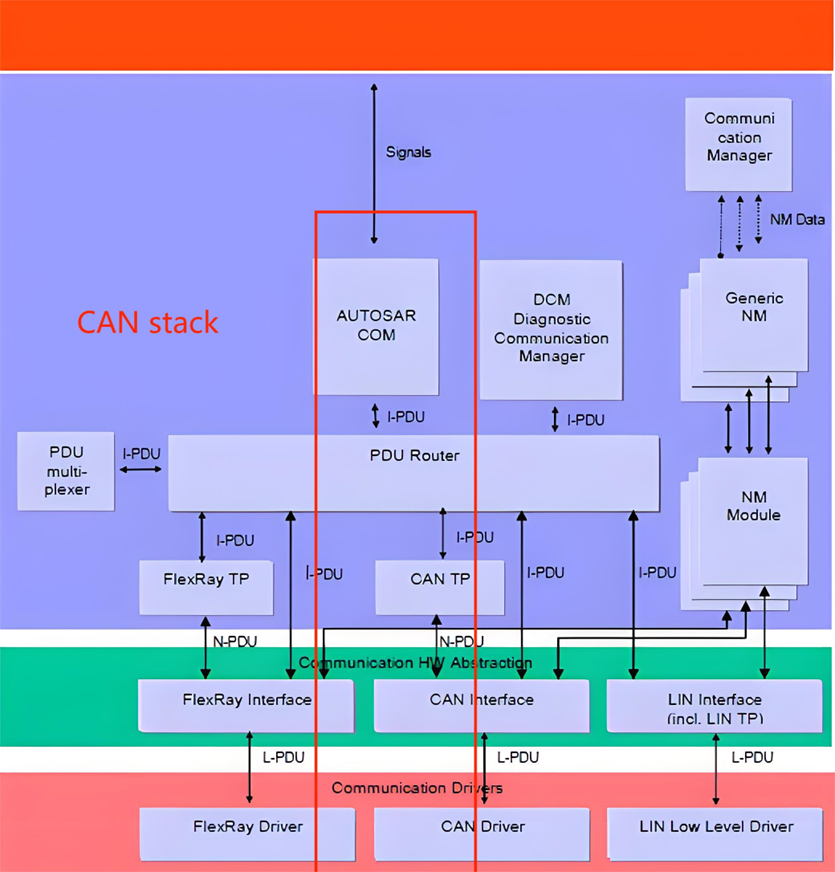
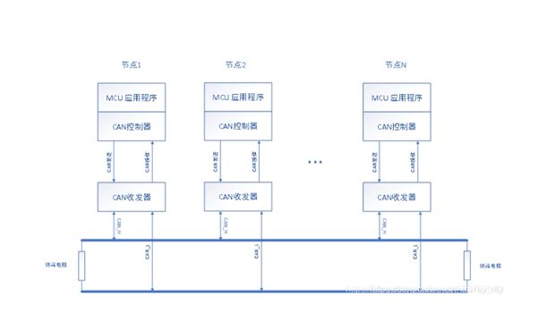
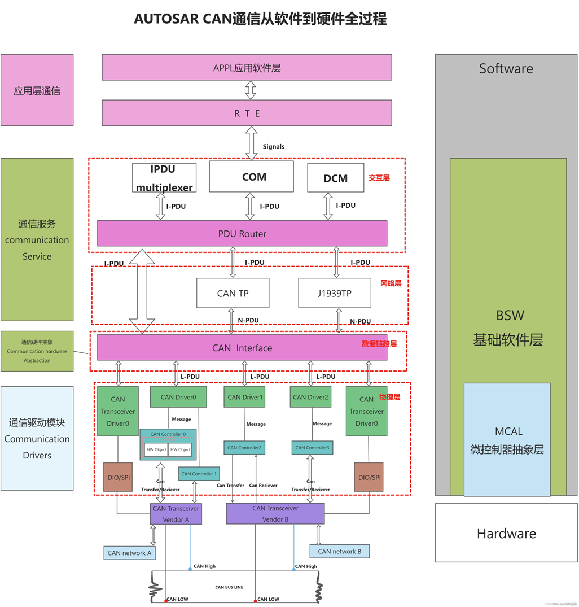
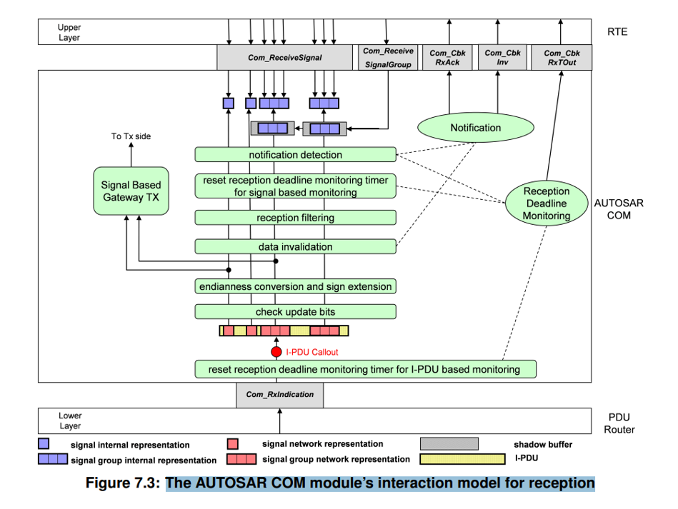
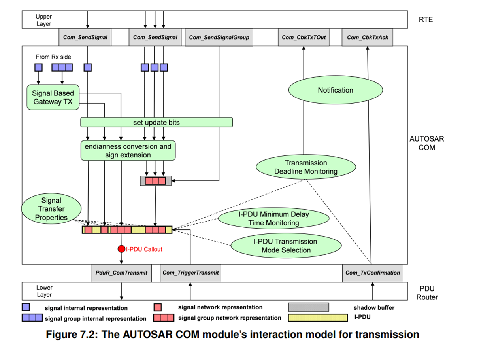

# Autosar CAN 协议栈

## 目录

 1. [CAN协议栈基本概念](##CAN协议栈基本概念)
 2. [Com模块](##Com模块)
 3. [Pdur模块](##Pdur模块)
 4. [CANif模块](##CANif模块)
 5. [CAN模块](##CAN模块)

## CAN协议栈基本概念
AUTOSAR 通信协议栈对应用层隐藏了对总线相关的协议和报文属性, 以基本的CAN通信来说,其发送机制的路径为: 

**RTE->COM->PduR->CanIf->Can Driver**

基本过程可以描述如下:

1. COM 模块 : COM 模块首先是获取到了 应用层的 signal 信号后, 会进行一个封装, 把信号封装成 I-PDU, 并发送给 PDuR 模块. I-PDU (Internation Layer Protocol Data Unit)
2. PduR 模块: PDuR 路由协议中指定的I-PDU接收模块, 接收到 I-PDU 的消息后, 会经过一定的处理发送给 CanIf模块
3. CanIf模块: CAN if(CAN Interface),mCanIF将收到的 I-PDU信号,经过处理为 L-PDU(Data Link Layer Protocol Data Unit)信号, 并发送给 Can Driver模块 

**术语解析**
| 术语 | 定义 |
|------|------|
| signals | 信号 |
| PDU     | Protocol Data Unit，PDU 由 SDU(Signal Distribution Unit)信号分发器 和 外部控制器接口PCI组成 |
| I-PDU   | Internation Layer PDU |
| N-PDU   | Network Layer PDU/I-PDU segment |
| L-PDU   | Data Link Layer PDU或者Lager PDU，一个或者多个I-PDU被打包成L-PDU，L-PDU是基于总线的，例如 CAN 总线的 L-PDU 就是 CAN 帧 |
| message | 报文 |

**Note**
CAN 数据传输上不上 Autosar 的架构是不一样的, 例如不上 Autosar 的架构, 使用上图的 节点发送报文, 和接收报文即可, 但是如果上 Autosar CAN stack 架构的话, 就是CAN是数据的传输流程上就是多了几个步骤, 例如 一些 PUD , I-PDU , CANIf, L-PDU 等一些模块

**从软件到硬件的 CAN 信号传输 流程整体图**

1. 从上图可以清晰的看出, 整个 CAN 的通信的流程

## Com模块

1. Com 模块主要位于运行环境(RTE)和PDuR模块之间, 主要功能有:

- 负责接收RTE层的signal信号封装成 I-PDU 传输给 PDuR模块, 负责从 PDuR模块上传来的I-PDU数据中解析出 signal信号
- 提供信号的路由功能, 将接到的 I-PDU 数据打包转发给 PDuR 模块, 
- 通信控制,控制(I-PUD的启/停)
- 发送请求应答等

2. **COM层与RTE和PDUR接收交互模型**
这里核心的关注分析是:从下往上进行数据的传递分析, 以及单组信号的解析和多组信号的解析, 同时多组信号中的 E2E 之间的特殊信号组的保护校验等,都可以从下图中进行体现

3. **COM层与RTE和PDUR传输交互模型**
这里的模型和上述的接收模型相反, 是传输的模型, 分析的关键和上述类似, 不过数据流是从上往下, 因为这里是传输模型

## PDuR 模块

