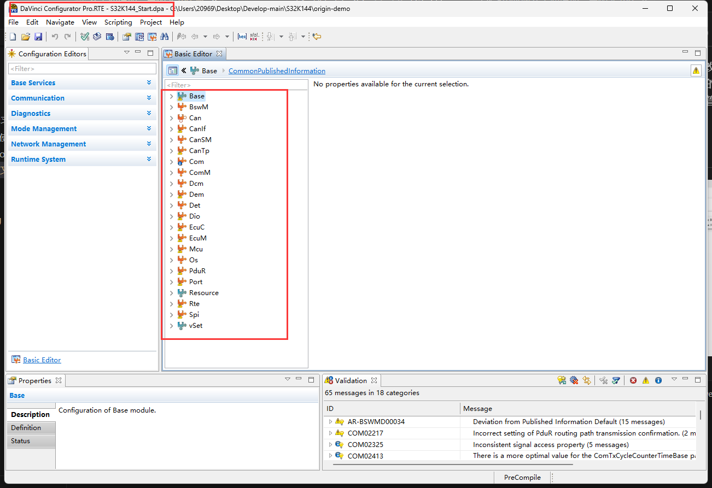
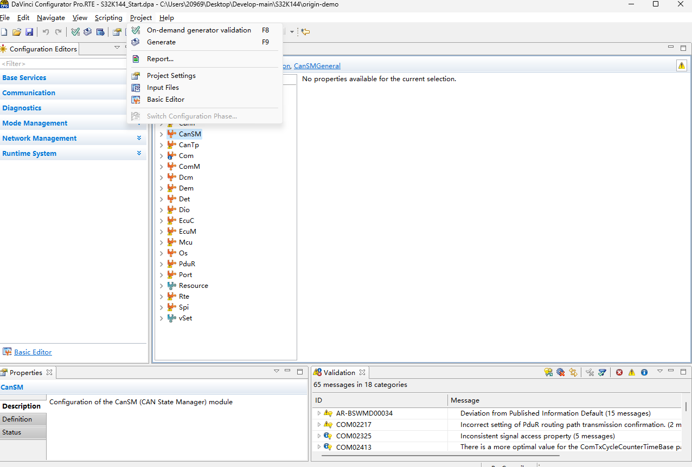
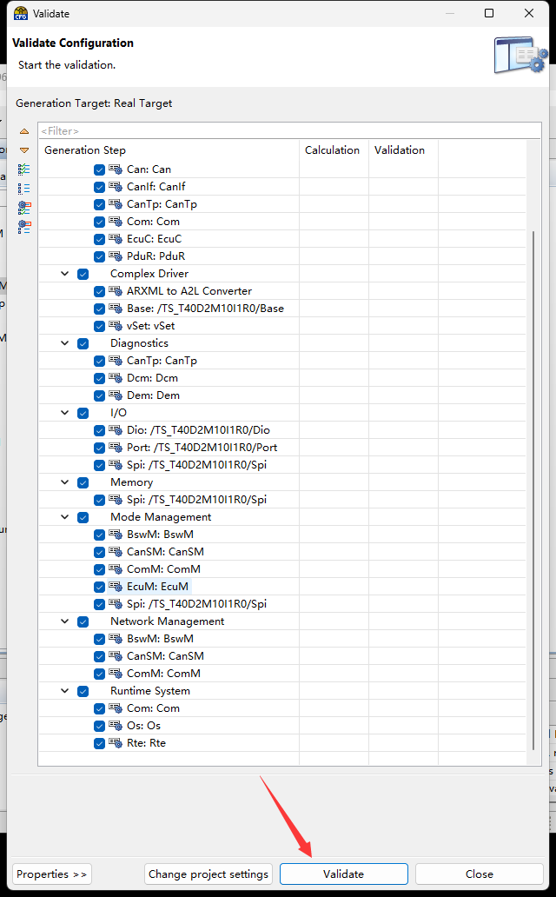
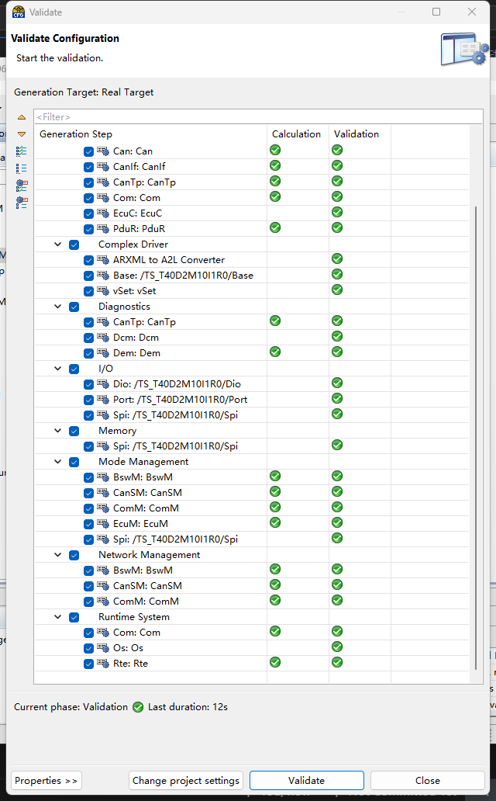
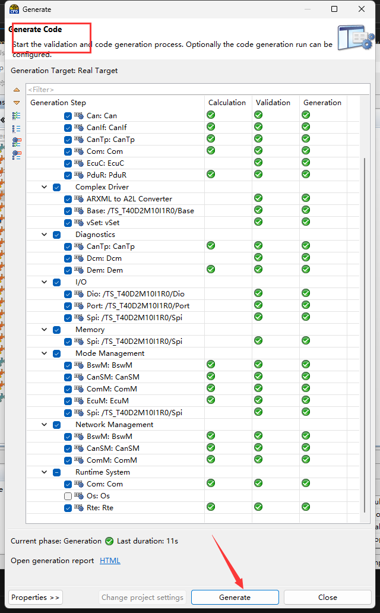
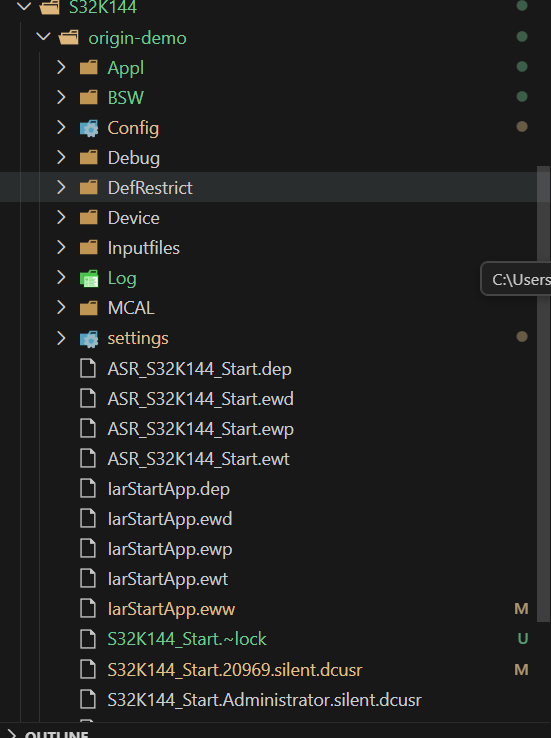
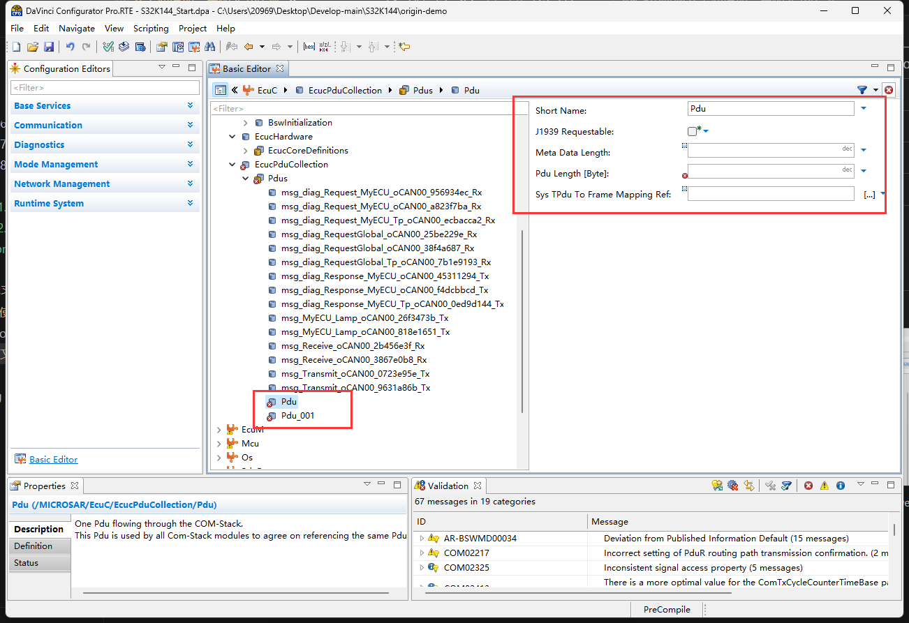
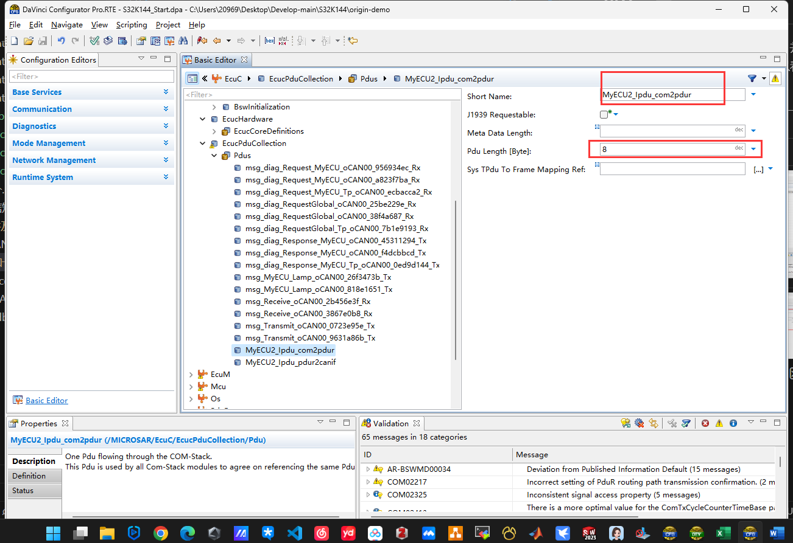

# 手动增加一条报文

## 目录

1. [目的](##目的)
2. [原始SIP-demo](##原始sip-demo)
3. [打开SIP包](##打开SIP软件包)
4. [代码生成](##代码生成)
5. [新增报文清单](##新增报文清单)
6. [模块配置](##模块配置)

## 目的
在DBC文件相关的讲解中,已经介绍了了如何分析DBC文件,制作DBC文件,并通过DavinciCFG工具通过输入的 DBC 文件生成了CAN相关的STACK协议栈的相关模块,并对这些模块进行了熟悉和了解,例如其中的CAN-STACK的COM模块,PDUR模块,CANIF模块,CAN模块等等,并结合信号的传输流程进行了梳理,但是不够深入,只是从直观的角度对相关的链路进行熟悉,**并且模块还是有报错的,而且缺少例如RTE层和OS以及MCAL相关的内容,导致我们是不能直接生成代码,可运行的环境的**,下面将通过手动增加一条报文的形式,进行一个实战的演练和熟悉

## IAR-S32K144-原始SIP demo

1. 修改代码是在原始层demo上进行的改动, 原始demo 是 Vector 公司针对 S32K144 给出的 一个 IAR 的SIP软件包的 demo
2. 配置之前一定要对 SIP 进行 git 版本管理, 这样进行配置改动时, 能快捷的找到对应的改动进行回溯

## 打开 SIP 软件包
1. 用 DaVinci CFG 打开工程.dba文件 ,以看到 demo 中的配置模块是相对完整的,而且没有错误XX 的

## 代码生成
1. On-demand 工程检查

2. Generate code 代码生成,正常的 project 检查没有问题的话,就可与进行代码的生成了

3. 代码生成成功后, origin-demo 基本没啥问题, 可以进行目标的完成了

## 报文配置清单
1. 要手动田间一条CAN报文,需要相关的配置项进行配置,需要进行配置的配置模块是和CAN-STACK相关的模块,如下所示,这里非完全展示
    | 项目      | 值 |
    |-----------|-----|
    | Signal    | RearLeft_Window |
    | Message   | Msg_MyECU2_Transmit |
    | ID        | 0x600 |
    | CAN类型   | STANDARD_CAN |

    | 配置层  | 映射关系 |
    |--------|----------|
    | COM->PDUR   | MyECU2_Ipdu_com2pdur |
    | PDUR->CANIF | MyECU2_Ipdu_pdur2canif |

    | 配置项  | 名称 |
    |--------|------|
    | ComIpdu | MyECU2_Com_CAN_Network |
    | PduSignalProcess | - |
    | ComIpduType | - |
    | ComIpduGroupRef | - |
    | 创建 | ComSignal |
    .....

## 模块配置

1. 首先在 EcuC 中添加两条 pdu, 并编辑对应的信息,在EcuC中添加两个目的是有CAN-STACK可以看出有两条 I-PDU 的线路:

    | 配置层  | 映射关系  |
    |---------|----------|
    | **COM->PDUR**   | MyECU2_Ipdu_com2pdur |
    | **PDUR->CANIF** | MyECU2_Ipdu_pdur2canif |

    
    
    

2. 配置COM模块,先添加signal的相关内容

