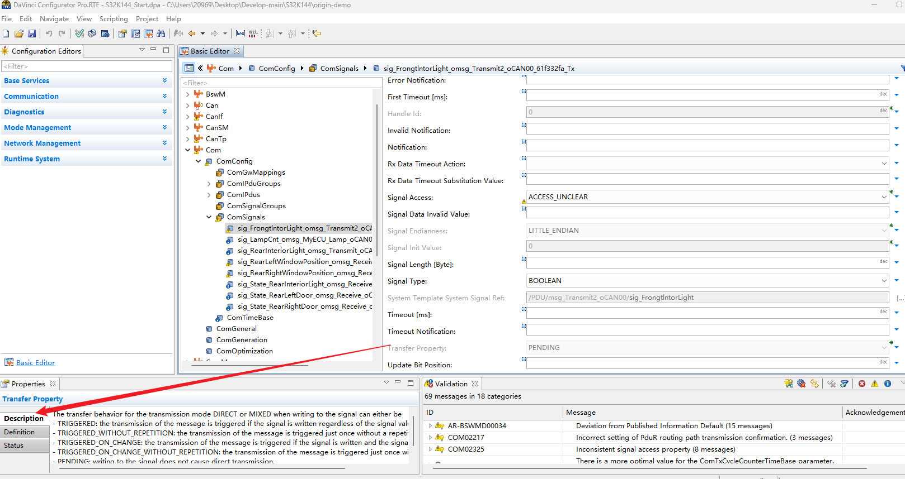
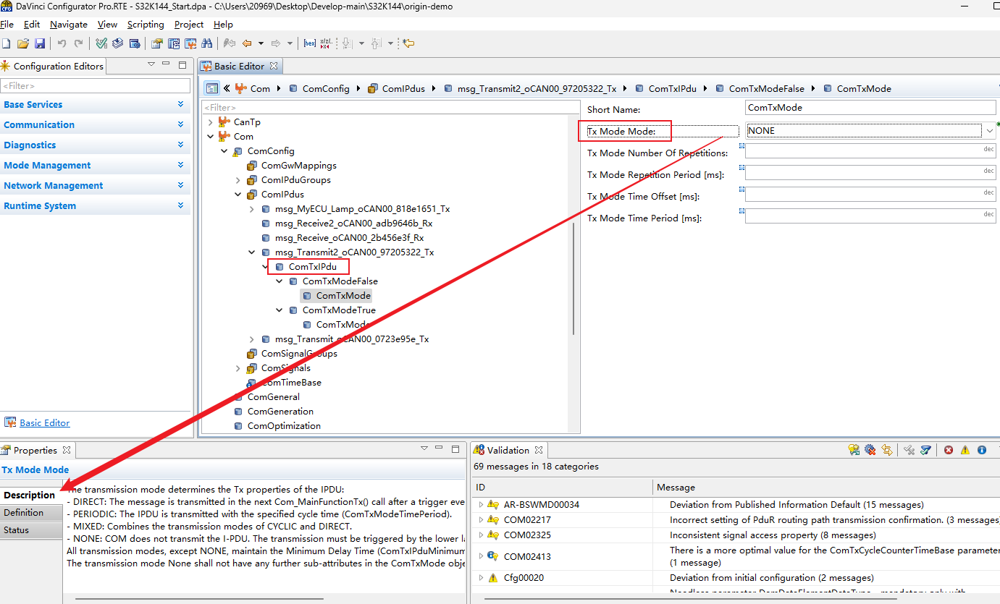
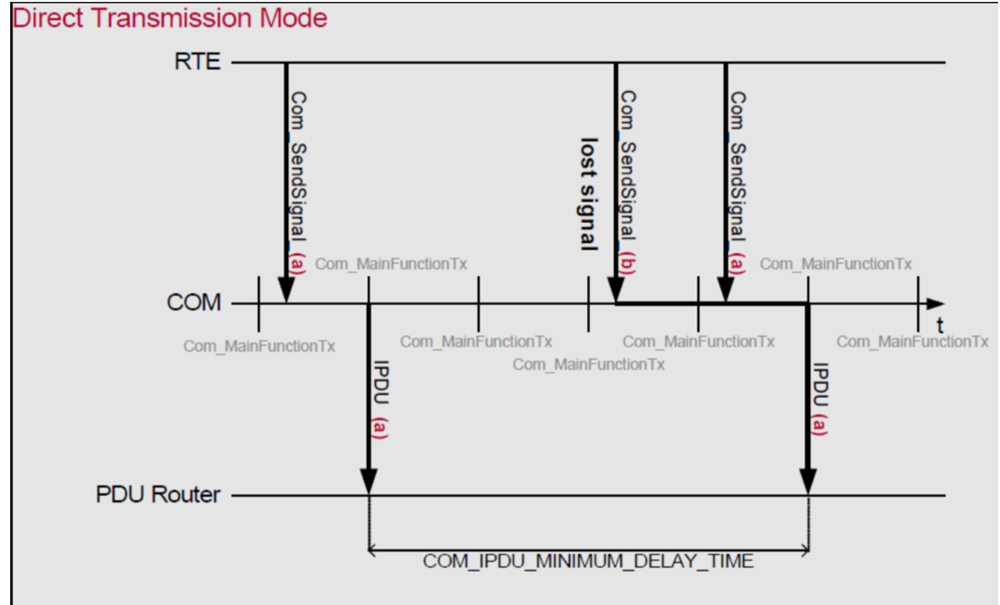
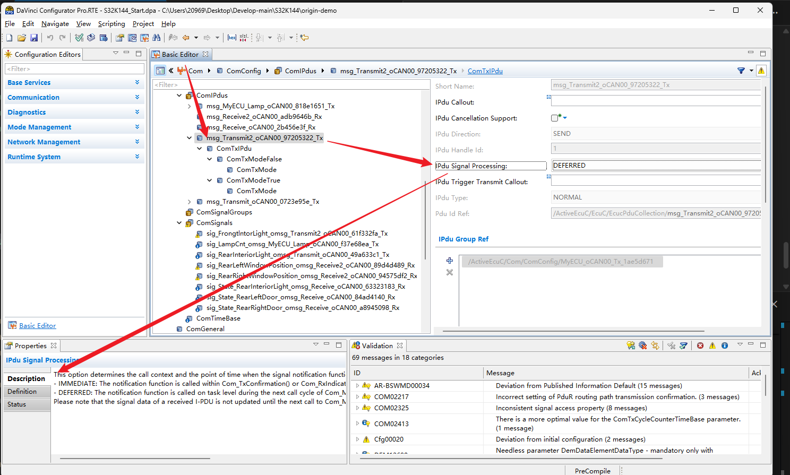
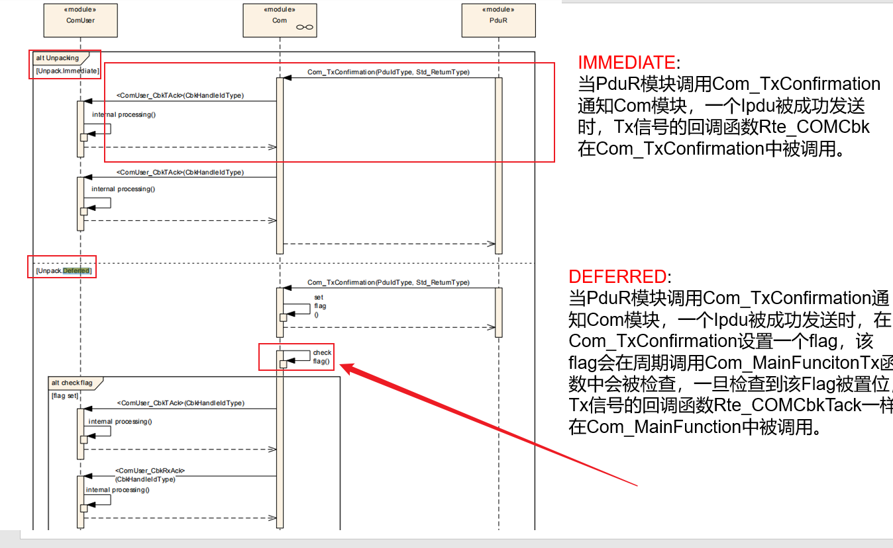

# CAN 发送报文配置

## 目录

## 1. 简述
完全手动进行CAN发送报文和接收报文配置,以及借助于DBC来进行报文的新增和配置,
明显看了起来是通过DBC来进行统一新增和配置是更有效率的,而且更加的标准化,有
利于不同的团队和公司之间进行统一的使用,而且在配置起来是明显是比手动配置要
容易的多,解决的问题相对少一点.

接下面记录一下配置发送报文时需要注意的一些特殊的重要属性:

## 2. 相关属性

1. **Transfer Property**
Com->Comconfig->Comsignals->pending
这里的 pending 的意思是:发送报文时,写入数据不会导致方向改变(信号仅仅保持发送的特性,不会切换到接收模式):

    

    **Note**
    ---
    The transfer behavior for the transmission mode DIRECT or MIXED when writing to the signal can either be
    - TRIGGERED: the transmission of the message is triggered if the signal is written regardless of the signal value
    - TRIGGERED_WITHOUT_REPETITION: the transmission of the message is triggered just once without a repetition
    - TRIGGERED_ON_CHANGE: the transmission of the message is triggered if the signal is written and the signal value has changed
    - TRIGGERED_ON_CHANGE_WITHOUT_REPETITION: the transmission of the message is triggered just once without a repetition
    - PENDING: writing to the signal does not cause direct transmission.

    triggered:调用Com_SendSignal()服务请求发送具备triggered属性的信号发送,可以触发相关的I-PDU的发送,但是如果I-PDU被配置成周期发送的形式,那么只更新信号的值,不会触发I-PDU的立刻发送(如果I-PDU被配置成direction,就会伴随着信号的更新直接进行发送的),只会在下一个周期进行I-PDU的触发发送

    Pending:调用Com_SendSignal()服务请求发送具备Pending的属性信号的发送,不会触发I-PDU相关进行发送, 因为我们的signal 信号实际上是绑定在了我们的 I-PUD 上, ,但是我们也可以进行配置选择不进行 I-PDU 的触发发送

2. **Transmission Mode**
Com/ComConfig/ComIPdus/msg_Transmit2_oCAN00_97205322_Tx/ComTxIPdu/ComTxModeTrue/ComTxMode
这里配置的是车载通信中I-PDUD的属性 **什么时候发 怎么发 发多少次** 的问题

    

    **Note**
    ---
    The transmission mode determines the Tx properties of the I-PDU:
    - DIRECT: The message is transmitted in the next Com_MainFunctionTx() call after a trigger event occurred.
    - PERIODIC: The I-PDU is transmitted with the specified cycle time (ComTxModeTimePeriod).
    - MIXED: Combines the transmission modes of CYCLIC and DIRECT.
    - NONE: COM does not transmit the I-PDUs. The transmission must be triggered by the lower layer through Com_TriggerTransmit().
    All transmission modes, except NONE, maintain the Minimum Delay Time (ComTxIPduMinimumDelayTime) and delay a transmission if required.
    The transmission mode None shall not have any further sub-attributes in the ComTxMode object.

    - Direction: 通俗理解就是随时随发,例如一些刹车,气囊等一些信号
    - Periodic : 定时发,例如一些车速,转速等相关的信号
    - MIXED    : 混合,上面两种方式的结合了,例如一些(车门状态,突发锁门等)
    - NONE     : COM模块不主动进行发送,依赖底层模块的调用发送,手动的进行触发,例如发送B事件,发送C报文,这种场景
    这里注意 diretion
    

    Autosar 的 COM 模块允许每个I-PDU配置不同的Transmission mode,ComTxModeTrue和ComTxModeFalse这两个属性,在没有调用 Com_SwitchIpduTxMode API 的情况下, 默认 Transmission Mode 的发生模式为 ComTxModeTrue 

3. **TMC 和 TMS**
TMS(Transmssion Mode Selector) 用于对 Transmission Mode 的 False和 True的判断和 TMC(Transmission Mode Contion)发送模式的条件

- 发送端信号的 TMC 的计算于接收端的信号过滤机制相同, 但是在发送端信号的过滤不会丢弃任何的信号, 而只是用于计算信号的 TMC 的值

- 发送端的 TMS , 一个 I-PDU 的 TMS 的值是根据所有下属的 TMC 结果来决定的, 并且只有这个 I-PDU的所有下属的 TMC 的值都是 False 时,TMS的值才为 False,否则有任何一个True 的话, 这个I-PDU 的 TMS 值就会为 True

- 总的来看, 可以为每个 I-PDU 配置两种发送模式, 在程序的运行过程中, 某 I-PDU 的发送模式是由 TMS 来决定的, 若某个 TMS 为 True, 则该 I-PDU 的发送模式为 True, **如果 I-PDU 的某个下属的 信号过滤算法配置为 always ,那么这个I-PUD会一直以 True 的模式进行发送**

4. **Ipdu Signal Processing**
/ActiveEcuC/Com/ComConfig/msg_Transmit2_oCAN00_97205322_Tx[0:ComIPduSignalProcessing]   

    

    **Note**
    ---

    This option determines the call context and the point of time when the signal notification function is called.
    - IMMEDIATE: The notification function is called within Com_TxConfirmation() or Com_RxIndication(). Depending on the lower layer interface, this might be in interrupt context.
    - DEFERRED: The notification function is called on task level during the next call cycle of Com_MainFunctionRx() or Com_MainFunctionTx().
    Please note that the signal data of a received I-PDU is not updated until the next call to Com_MainfunctionRx().

    - 这里每个 Pdu 都有对应的ComIPduSignalProcessing配置,有两个选型:

    - IMMEDIATE: 通知函数 在Com_TxConfirmation() 或Com_RxIndication() 中被调用. 其二 带有 IMMEDIATE 的信号处理的被触发信号的传输将在各 Com_MainfunctionTx() 中**下一次调用中被触发**
    - DEFERRED: 其一 通知函数 在 Com_MainfunctionTx() 或 Com_MainfunctionRx() 的**下一个周期中被调用**, 信号处理DEFERRED的 I-PDU 中包含的信号值将在各自的Com_MainFunctionRx() 中在任务级别上进行更新,图示如下:
    
    从图中也能很清晰的看到不同的选择对应的不同处理逻辑

    

    

