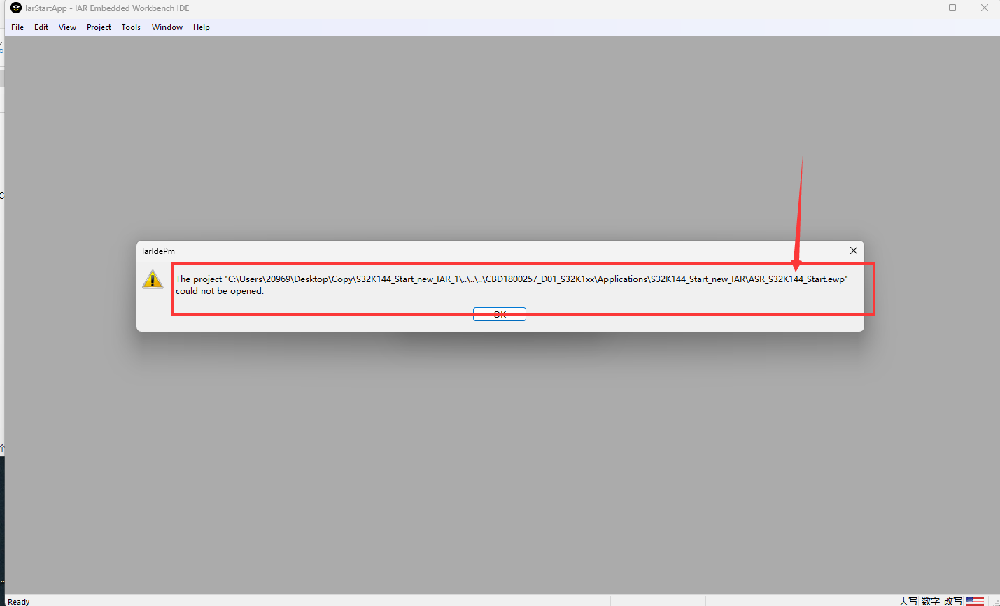
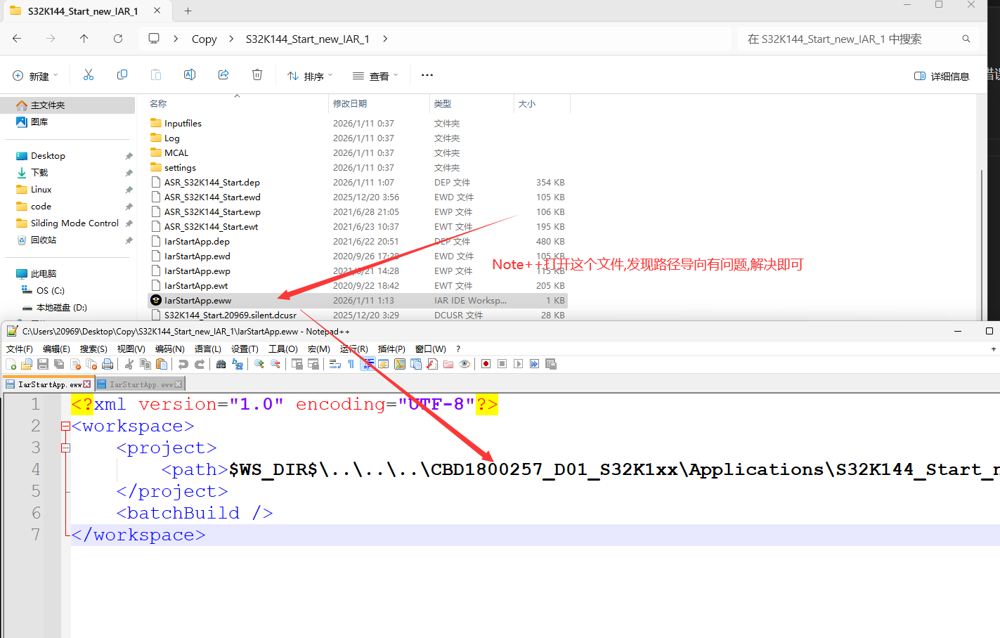

## 问题背景描述

1. IAR 的项目, 代码项目整体移动到另外一个地方后, 无法打开工程文件, 显示下面的错误:




## 问题解决

2. 仔细观察我们的工程路径,发现ASR_S32K144_Start.ewp这个文件就在当前的路径下, NotePad++ 打开 IarStartApp.eww 这个文件, 改下执向路径即可



```xml
<?xml version="1.0" encoding="UTF-8"?>
<workspace>
    <project>
        <path>$WS_DIR$\ASR_S32K144_Start.ewp</path>
    </project>
    <batchBuild />
</workspace>
```